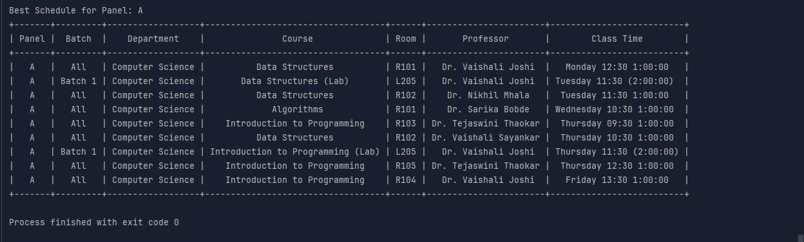

# University Timetable Scheduling


This project implements a genetic algorithm to generate optimized timetables for university courses. It uses Streamlit to provide an interactive web interface for inputting data and viewing generated schedules.


## Features

- Input university data including rooms, professors, courses, departments, and panels
- Generate optimized timetables using a genetic algorithm
- Handle both lectures and lab sessions
- Account for multiple batches within panels
- Avoid scheduling conflicts for rooms, professors, and batches
- Checks for conflicts regarding professor availability
- Display generated timetables in an easy-to-read format

## Installation

1. Clone this repository: 
    ```
    git clone https://github.com/penzulo/timetable-ga.git
    cd university-timetable-scheduling
    ```
2. Install the required dependencies:``poetry install --no-root --without=dev``

## Usage
1. Run the Streamlit app: `streamlit run app.py`
2. Open your web browser and navigate to the URL displayed in the terminal (usually http://localhost:8501)
3. Use the web interface to input your university data:
   - Add rooms and lab rooms
   - Add professors
   - Add departments and courses
   - Add panels and specify the number of batches
4. Click the "Generate Timetable" button to create optimized schedules
5. View the generated timetables for each panel
6. This is the sample output 

## Project Structure
- `app.py`: Main Streamlit Application
- `constants.py`: Constant values used throughout the project.
- `models.py`: Data models for university entities (Room, Professor, Course, etc.).
- `schedule.py`: Schedule and Data classes for managing generation.
- `genetic_alg.py`: Implementation of the genetic algorithm.
- `data.py`: Utility functions for displaying data (more to come).

## Customization
You can adjust the genetic algorithm parameters in `constants.py` to fine-tune the optimization process:
- `POPULATION_SIZE`: Number of schedules in each generation
- `NUMB_OF_ELITE_SCHEDULES`: Number of top schedules to carry over to the next generation
- `TOURNAMENT_SELECTION_SIZE`: Number of schedules to consider in tournament selection
- `MUTATION_RATE`: Probability of mutation for each schedule
- `GENERATIONS`: Maximum number of generations to run the algorithm


## Contributing

Contributions are welcome! Please feel free to submit a Pull Request.